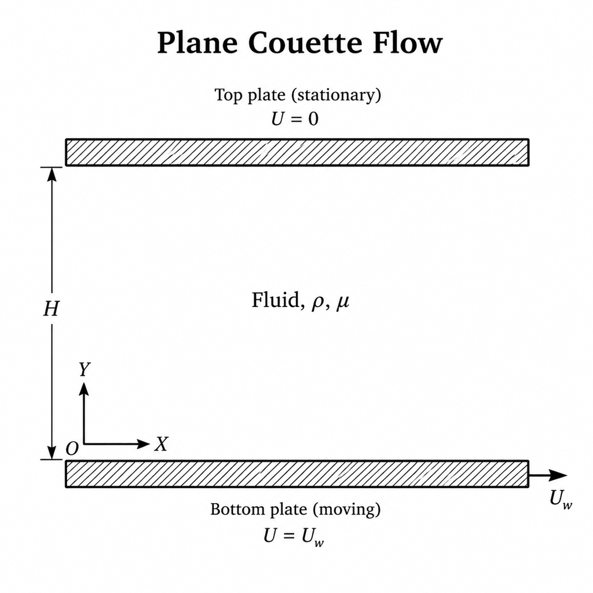

# Geometry

The physical configuration is plane Couette flow between two infinite, parallel plates separated by a constant distance $H$. The $x$-axis is aligned with the plates and the $y$-axis is normal to them. The bottom plate at $y=0$ moves with velocity $U_w$, while the top plate at $y=H$ is stationary.

For the one-dimensional transient diffusion model, only the coordinate normal to the plates is represented. The computational domain is therefore the finite interval

$$
0 \le y \le H,
$$

where $H$ is the plate separation. The streamwise direction is omitted from this one-dimensional model.

  

<strong>Figure 1.</strong> Geometry of the channel between the parallel plates.

Figure 1 shows the origin on the bottom plate. The lower and upper boundaries of the computational interval correspond to the bottom and top plates, respectively.

## `Geometry` class

The `Geometry` class stores the domain length, which corresponds to $H$ for this configuration. It expects a positive length and rejects values less than or equal to zero. `GetLength()` returns the stored length, and `SetLength()` changes it while applying the same check.

The class stores the domain length only. Plate velocities and boundary conditions are not represented by the `Geometry` class.
