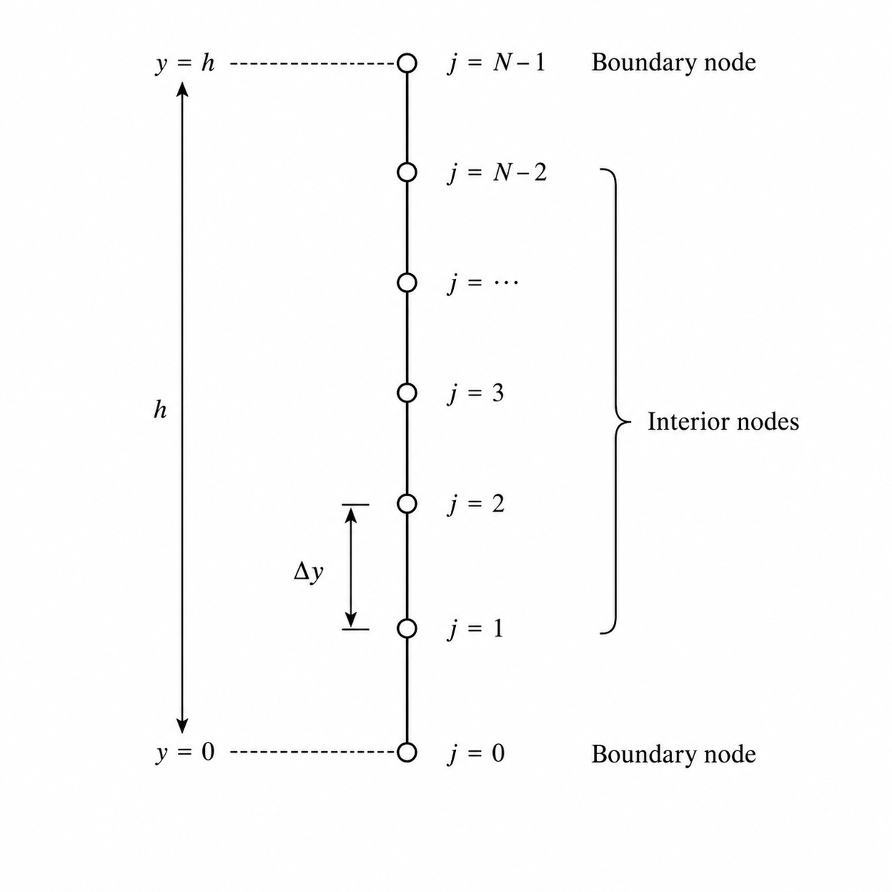

# Uniform One-Dimensional Mesh

The spatial domain is the interval $0 \le y \le H$, where $H$ is the length supplied by the `Geometry` object. `Mesh` divides this interval into a uniform one-dimensional grid.

Let $N$ be the number of nodes. The grid contains $N-1$ intervals, so the spacing is

$$
\Delta y = \frac{H}{N-1}, \qquad N \ge 2.
$$

The node coordinates are

$$
y_j = j\Delta y, \qquad j=0,1,\ldots,N-1.
$$

Indexing starts at zero: node $j=0$ is at the bottom boundary and node $j=N-1$ is at the top boundary. The mesh generation sets the last coordinate directly to $H$ so it matches the domain length despite floating-point rounding.

  

<strong>Figure 1.</strong> Uniform grid over the one-dimensional domain.

Figure 1 shows the nodes and spacing used to represent the spatial coordinate. `Mesh` handles spatial discretization; it does not define time levels or a time step.

## `Mesh` class

Construct a mesh from a `Geometry` object and a node count. The count must be at least two; otherwise, construction or `Set_N()` throws `std::invalid_argument`.

The class provides:

- `Get_N()` for the node count and `Get_Delta()` for the uniform spacing.
- `GetValue(j)`, `Get_Grid()`, and the read-only `operator` for node coordinates.
- `Set_N(N)` to change the node count and regenerate the grid over the same domain.
- `Print()` to display node indices and coordinates.
